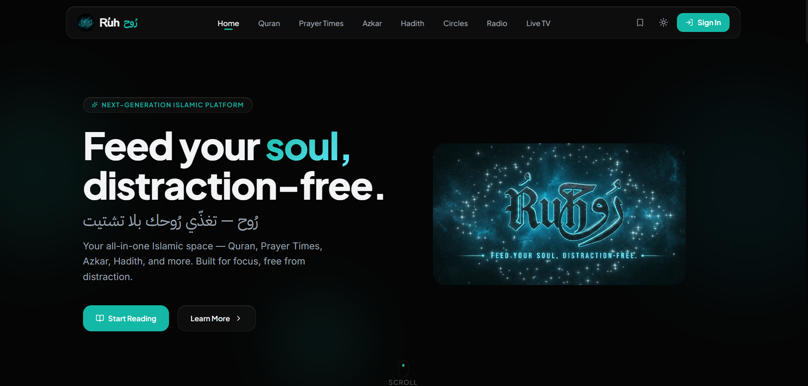

<div align="center">



<br/>

# رُوح | Rُuh

### _Feed your soul, distraction-free._

**A next-generation Islamic platform for Quran reading, Prayer Times, Azkar, Hadith, Study Circles, Islamic Radio, and Live TV.**
**Designed for deep focus and spiritual immersion.**

<br/>

<p>
  
  
  
  
  
</p>

<sub>MIT Licensed &nbsp;•&nbsp; Bilingual (AR/EN) &nbsp;•&nbsp; Zero Ads</sub>

</div>

<br/>

<div align="center">

### 🕋 &nbsp; One app for Quran, Prayer, Azkar, Hadith, Community, and more.

|             📚 Quran             |    🕌 Prayer Times     |         📿 Azkar          |       📜 Hadith        |      🤝 Halaqah       |       📻 Radio       |      📺 Live TV       |
| :------------------------------: | :--------------------: | :-----------------------: | :--------------------: | :-------------------: | :------------------: | :-------------------: |
| Dual-mode reader + gapless audio | GPS-based, 20+ methods | Tap-to-count, categorised | Bukhari, Muslim & more | Group reading circles | Curated live streams | Curated live channels |

</div>

<br/>

<div align="center">

### 📖 Contents

🌙 [About the Project](#-about-the-project) &nbsp;·&nbsp;
✨ [Key Features](#-key-features) &nbsp;·&nbsp;
🛠️ [Tech Stack](#️-tech-stack) &nbsp;·&nbsp;
🌐 [API Reference](#-api-reference) &nbsp;·&nbsp;
📁 [Project Structure](#-project-structure)

🚀 [Getting Started](#-getting-started) &nbsp;·&nbsp;
🔑 [Environment Variables](#-environment-variables) &nbsp;·&nbsp;
📜 [Available Scripts](#-available-scripts) &nbsp;·&nbsp;
🗄️ [Database Models](#️-database-models) &nbsp;·&nbsp;
🎯 [Architecture Highlights](#-architecture-highlights)

👨‍💻 [Author](#-author) &nbsp;·&nbsp;
🤝 [Contributing](#-contributing) &nbsp;·&nbsp;
📄 [License](#-license)

</div>

<br/>

<div align="center">

═══════════ ❁ ═══════════

</div>

## 🌙 About the Project

**Rُuh (رُوح)** is a premium, full-stack Islamic web application built to serve as a single, distraction-free spiritual hub for Muslims worldwide. The platform takes a purposeful approach to Islamic technology — no ads, no clutter, just meaningful tools for worship, learning, and community.

At its core, Rُuh solves the fragmentation problem in Islamic apps: a user previously needed a Quran app, a separate prayer times app, a hadith browser, and another tool for daily azkar. Rُuh brings all of these under one beautifully crafted, bilingual (Arabic/English) platform focused on the most important parts of Islam, complete with user accounts that sync preferences and reading progress across devices.

The app features a **Halaqah (Study Circle)** system that lets groups of Muslims read the Quran together in a coordinated, social fashion — tracking collective progress in real time and sharing reflections on individual ayahs.

<div align="center">

═══════════ ❁ ═══════════

</div>

## ✨ Key Features

<table>
<tr>
<td width="50%" valign="top">

### 📚 Quran Reader

- Full Quran browsing across all 114 Surahs with rich metadata
- **Dual reading modes**: Classic verse-by-verse list and authentic **Madani Mushaf** (page-by-page) layout with Hafs script
- Verse-level bilingual translation (English: Saheeh International, Arabic: Al-Mukhtasar tafsir)
- Arabic-only verse search via the Bonyanoss API
- **Ayah bookmarking** — saves individual verses for later reference, synced to user account
- **Continue Reading** — automatically remembers last read position

</td>
<td width="50%" valign="top">

### 🎧 Quran Audio Player

- Full Surah audio recitation with a large library of renowned reciters
- **Dual listening modes**: Ayah-by-Ayah (for following along) and Full Surah (for immersive listening)
- **Double-buffer, gapless playback engine** — two `HTMLAudioElement` instances (active + standby) with sub-frame crossfade for zero audible gap between ayahs
- Precise ayah-by-ayah audio-text synchronization (active ayah highlighted in real time)
- Auto-scroll to the playing ayah
- In-browser reciter library with the ability to mark favourites
- ID3 metadata embedding for downloaded audio files

</td>
</tr>
<tr>
<td width="50%" valign="top">

### 🕌 Prayer Times

- Automatic GPS-based location detection
- Integrates with the **Aladhan API** for accurate times using 20+ calculation methods (MWL, ISNA, Egyptian, Umm al-Qura, etc.)
- Beautiful animated **sun arc** visualisation showing the current position of the sun in the day
- **Monthly & Annual Hijri prayer calendar** for planning ahead
- **Adhan push notifications** — configurable per-prayer, with notification audio and minute offsets
- DST manual adjustment toggle (+1/-1 hour)
- Reverse geocoded location display in Arabic & English via Nominatim/OpenStreetMap

</td>
<td width="50%" valign="top">

### 📿 Azkar (Remembrance)

- Categorised azkar (Morning, Evening, After Prayer, Sleep, etc.)
- Interactive counter with tap-to-count and animated progress ring
- Progress tracking across categories, persisted to the Zustand store

### 📜 Hadith Browser

- Browse major hadith collections (Bukhari, Muslim, etc.) — served entirely from local JSON files (zero latency, zero API cost)
- Hierarchical navigation: Collection → Chapter → Individual Hadith
- Server-side rendering for fast initial loads

</td>
</tr>
<tr>
<td width="50%" valign="top">

### 🤝 Halaqah (Study Circles)

- Create or join a study circle with a unique invite code
- Track which ayahs each member has read on a shared, live-updating progress map
- Members can leave **Reflections** on individual ayahs — visible to the whole group
- Optimistic UI updates for instant feedback, backed by a 15-second polling strategy
- **Weekly Digest Email** — automated Vercel cron job (Fridays 5am UTC / 8am EGY Summer / 7am EGY Winter) summarising each circle's week
- Circle management: rename, remove members, delete

</td>
<td width="50%" valign="top">

### 📻 Islamic Radio

- Curated list of Islamic radio stations
- HLS live audio streaming via `hls.js`

### 📺 Live TV

- Curated list of Islamic TV channels
- HLS live video streaming with a dedicated fullscreen player

### 🔐 Authentication

- **Google OAuth** one-click sign-in
- **Email/Password** credentials with bcrypt password hashing
- JWT-based sessions (30-day expiry)
- Preference sync on login via server-stored settings

</td>
</tr>
</table>

### 🎨 UI/UX

- Full **dark/light mode** toggle (defaults to dark) via `next-themes`
- Partially **bilingual UI** with RTL-aware Arabic rendering
- Custom Quranic typefaces (QPC Hafs, Surah Header fonts)
- Smooth page transitions and micro-animations powered by **Framer Motion** and **GSAP**
- Responsive design — optimised for mobile, tablet, and desktop

<div align="center">

═══════════ ❁ ═══════════

</div>

## 🛠️ Tech Stack

<details open>
<summary><b>🖥️ Frontend</b></summary>
<br/>

| Category   | Technology                                                                         |
| ---------- | ---------------------------------------------------------------------------------- |
| Framework  | [Next.js 16](https://nextjs.org/) (App Router)                                     |
| UI Library | [React 19](https://react.dev/)                                                     |
| Styling    | [Tailwind CSS v4](https://tailwindcss.com/)                                        |
| Animation  | [Framer Motion v12](https://www.framer.com/motion/) + [GSAP v3](https://gsap.com/) |
| Icons      | [Lucide React](https://lucide.dev/)                                                |
| Theme      | [next-themes](https://github.com/pacocoursey/next-themes)                          |

</details>

<details>
<summary><b>⚙️ State Management & Data Fetching</b></summary>
<br/>

| Category             | Technology                                                            |
| -------------------- | --------------------------------------------------------------------- |
| Global State         | [Zustand v5](https://zustand-demo.pmnd.rs/) with `persist` middleware |
| Server State / Cache | [TanStack Query v5](https://tanstack.com/query) (React Query)         |
| Server Actions       | Next.js Server Actions (used for all DB mutations)                    |

</details>

<details>
<summary><b>🔐 Authentication</b></summary>
<br/>

| Category         | Technology                                       |
| ---------------- | ------------------------------------------------ |
| Auth Library     | [NextAuth v5 (Auth.js)](https://authjs.dev/)     |
| Providers        | Google OAuth, Email/Password Credentials         |
| Password Hashing | [bcryptjs](https://github.com/dcodeIO/bcrypt.js) |
| Session Strategy | JWT (30-day expiry)                              |

</details>

<details>
<summary><b>🗄️ Database & Backend</b></summary>
<br/>

| Category        | Technology                                                                  |
| --------------- | --------------------------------------------------------------------------- |
| Database        | [MongoDB Atlas](https://www.mongodb.com/atlas)                              |
| ODM             | [Mongoose v9](https://mongoosejs.com/)                                      |
| MongoDB Adapter | [`@auth/mongodb-adapter`](https://authjs.dev/reference/adapter/mongodb)     |
| Email           | [Nodemailer](https://nodemailer.com/) + [React Email](https://react.email/) |
| Deployment      | [Vercel](https://vercel.com/) (with Cron Jobs)                              |

</details>

<details>
<summary><b>🎵 Audio & Streaming</b></summary>
<br/>

| Category      | Technology                                                          |
| ------------- | ------------------------------------------------------------------- |
| HLS Streaming | [hls.js v1](https://github.com/video-dev/hls.js)                    |
| Audio Engine  | Custom double-buffer gapless player (`useAudioPlayer` hook)         |
| ID3 Metadata  | [browser-id3-writer](https://github.com/egoroof/browser-id3-writer) |

</details>

<details>
<summary><b>🖋️ Custom Fonts (Self-Hosted)</b></summary>
<br/>

| Font                 | Usage                                |
| -------------------- | ------------------------------------ |
| Plus Jakarta Sans    | Primary Latin UI font                |
| Inter                | Secondary Latin font                 |
| IBM Plex Sans Arabic | Arabic UI text                       |
| QPC Hafs             | Quranic Arabic script (reading view) |
| Surah Header         | Decorated Surah name headers         |

</details>

<div align="center">

═══════════ ❁ ═══════════

</div>

## 🌐 API Reference

### External APIs Consumed

<details>
<summary><b>1. 🕌 Aladhan API — Prayer Times</b></summary>
<br/>

**Base URL:** `https://api.aladhan.com/v1`

| Endpoint                        | Method | Description                                                     |
| ------------------------------- | ------ | --------------------------------------------------------------- |
| `/timings/{timestamp}`          | GET    | Today's prayer times for given coordinates & calculation method |
| `/methods`                      | GET    | All available prayer time calculation methods                   |
| `/hijriCalendar/{year}/{month}` | GET    | Monthly Hijri prayer calendar                                   |
| `/hijriCalendar/{year}`         | GET    | Annual Hijri prayer calendar                                    |

**Query Params:** `latitude`, `longitude`, `method` (Aladhan method ID)

</details>

<details>
<summary><b>2. 📖 Quran.com API — Surah & Mushaf Data</b></summary>
<br/>

**Base URL:** `https://api.quran.com/api/v4`

| Endpoint                       | Method | Description                                                        |
| ------------------------------ | ------ | ------------------------------------------------------------------ |
| `/chapters/{surahId}`          | GET    | Metadata for a single Surah                                        |
| `/verses/by_chapter/{surahId}` | GET    | All verses for a full Surah (Arabic text, QPC Hafs field)          |
| `/verses/by_page/{pageNumber}` | GET    | All verses on a Madani Mushaf page (includes word-level Hafs text) |

</details>

<details>
<summary><b>3. 📝 Quranenc — English Translation</b></summary>
<br/>

**Base URL:** `https://quranenc.com/api/v1`

| Endpoint                                              | Method | Description                                                    |
| ----------------------------------------------------- | ------ | -------------------------------------------------------------- |
| `/translation/aya/english_saheeh/{surahId}/{ayahNum}` | GET    | Saheeh International translation + footnotes for a single ayah |

</details>

<details>
<summary><b>4. 📝 Tafsir API (jsDelivr CDN) — Arabic Tafsir</b></summary>
<br/>

**Base URL:** `https://cdn.jsdelivr.net/gh/spa5k/tafsir_api@main/tafsir`

| Endpoint                                           | Method | Description                                  |
| -------------------------------------------------- | ------ | -------------------------------------------- |
| `/ar-tafsir-al-mukhtasar/{surahId}/{ayahNum}.json` | GET    | Al-Mukhtasar Arabic tafsir for a single ayah |

</details>

<details>
<summary><b>5. 🔍 Bonyanoss — Verse Search</b></summary>
<br/>

**Base URL:** `https://api.bonyanoss.org`

| Endpoint                               | Method | Description                   |
| -------------------------------------- | ------ | ----------------------------- |
| `/ayat/search?text={query}&limit=2000` | GET    | Full-text Arabic verse search |

</details>

<details>
<summary><b>6. ⚡ StaticQuran — Random & Specific Verse</b></summary>
<br/>

**Base URL:** `https://staticquran.vercel.app/api/v1`

| Endpoint                          | Method | Description                                            |
| --------------------------------- | ------ | ------------------------------------------------------ |
| `/ayah/random`                    | GET    | Fetch a random verse (used for the Daily Verse widget) |
| `/surah/{surahId}/ayah/{ayahNum}` | GET    | Fetch a specific verse                                 |

</details>

<details>
<summary><b>7. 🗺️ OpenStreetMap Nominatim — Reverse Geocoding</b></summary>
<br/>

**Proxied via:** `/osm-api/` (Next.js rewrite to `https://nominatim.openstreetmap.org`)

| Endpoint                                                          | Method | Description                                                         |
| ----------------------------------------------------------------- | ------ | ------------------------------------------------------------------- |
| `/reverse?lat={lat}&lon={lon}&format=json&accept-language={lang}` | GET    | Reverse geocode coordinates to a human-readable address in AR or EN |

> **Note:** Nominatim enforces a strict 1 request/second rate limit. The app enforces a 1.1-second delay between the Arabic and English calls.

</details>

<details>
<summary><b>8. 🖼️ Google OAuth — User Profile</b></summary>
<br/>

**URL:** `https://www.googleapis.com/oauth2/v3/userinfo`

Fetched server-side in the `jwt` callback to retrieve the user's profile picture after Google sign-in.

</details>

<details>
<summary><b>9. 🎙️ MP3Quran.net API — Reciters, Tafsir Audio & Live TV</b></summary>
<br/>

**Base URL:** `https://www.mp3quran.net/api/v3`

Used server-side at build time via Next.js ISR (revalidated hourly/daily). Provides the complete audio CDN infrastructure for the app.

| Endpoint                 | Method | Description                                                                    |
| ------------------------ | ------ | ------------------------------------------------------------------------------ |
| `/reciters`              | GET    | All reciters with Arabic names, moshaf types, and CDN server URLs              |
| `/reciters?language=eng` | GET    | Same reciter list with English names (merged client-side with Arabic response) |
| `/tafsir`                | GET    | Audio tafsir segments index, filtered per-surah for the listen page            |
| `/live-tv`               | GET    | All Islamic live TV channels with HLS stream URLs                              |

> **Audio CDN:** Recitation MP3s are streamed directly from each reciter's `server` field (e.g., `https://server6.mp3quran.net/...`). No separate API call is needed — the URL is constructed from the server + surah number.

</details>

<details>
<summary><b>10. 📚 QuranPedia API — Surah Contextual Information</b></summary>
<br/>

**Base URL:** `https://api.quranpedia.net/v1`

Fetched server-side per surah page (ISR, revalidated every 24 hours). Provides rich contextual background displayed in the Surah header.

| Endpoint                       | Method | Description                                                            |
| ------------------------------ | ------ | ---------------------------------------------------------------------- |
| `/surah/information/{surahId}` | GET    | Contextual information about the surah (themes, historical background) |

</details>

<details>
<summary><b>11. 📻 GitHub Raw (uthumany/radio-api) — Islamic Radio Stations</b></summary>
<br/>

**URL:** `https://raw.githubusercontent.com/uthumany/radio-api/main/client/public/api/stations.json`

Fetched server-side at build time (ISR, revalidated every hour). A community-maintained JSON file listing all Islamic radio stations with their HLS stream URLs.

| Resource        | Method | Description                                                 |
| --------------- | ------ | ----------------------------------------------------------- |
| `stations.json` | GET    | Full list of Islamic radio stations (`{ stations: [...] }`) |

</details>

<br/>

### Internal API Routes

<details open>
<summary><b>Show all internal routes</b></summary>
<br/>

| Route                      | Method   | Description                                                                                                |
| -------------------------- | -------- | ---------------------------------------------------------------------------------------------------------- |
| `/api/auth/[...nextauth]`  | GET/POST | NextAuth catch-all handler (sign in, sign out, session, callbacks)                                         |
| `/api/auth/register`       | POST     | New user registration (email/password)                                                                     |
| `/api/user/preferences`    | GET/PUT  | Read and update the authenticated user's persisted preferences                                             |
| `/api/cron/halaqah-digest` | GET      | Vercel Cron — sends weekly Halaqah progress digest emails (Fridays 05:00 UTC). Protected by `CRON_SECRET`. |
| `/api/unsubscribe`         | GET      | Unsubscribe a user from Halaqah digest emails                                                              |

</details>

<div align="center">

═══════════ ❁ ═══════════

</div>

## 📁 Project Structure

<details>
<summary><b>Click to expand full directory tree</b></summary>

```
ruh-app/
├── app/                          # Next.js App Router
│   ├── layout.js                 # Root layout (fonts, metadata, providers, navbar)
│   ├── page.js                   # Landing / home page
│   ├── providers.jsx             # Global providers (Session, Theme, QueryClient)
│   ├── globals.css               # Global Tailwind CSS + design tokens
│   ├── fonts.js                  # Self-hosted font definitions
│   ├── not-found.js              # Custom 404 page
│   ├── icon.png                  # App icon
│   │
│   ├── api/                      # API Route Handlers
│   │   ├── auth/
│   │   │   ├── [...nextauth]/    # NextAuth catch-all
│   │   │   └── register/         # POST — user registration
│   │   ├── user/
│   │   │   └── preferences/      # GET/PUT — user preferences sync
│   │   ├── cron/
│   │   │   └── halaqah-digest/   # GET — weekly email cron job
│   │   └── unsubscribe/          # GET — email unsubscribe
│   │
│   ├── auth/                     # Auth pages (sign-in, error)
│   ├── quran/                    # Quran feature
│   │   ├── page.js               # Surah browser
│   │   ├── [surahId]/            # Individual surah reading page
│   │   └── listen/               # Audio listening page
│   ├── prayer-times/             # Prayer times & calendar feature
│   ├── azkar/                    # Azkar / dhikr feature
│   ├── hadith/                   # Hadith browser
│   ├── halaqah/                  # Halaqah study circles
│   │   ├── page.js               # Dashboard (list of circles)
│   │   └── [halaqahId]/          # Individual circle detail & progress
│   ├── radio/                    # Islamic Radio page
│   └── live-tv/                  # Live TV page
│
├── components/                   # Reusable React Components
│   ├── layout/                   # Navbar, Footer, GlobalAudioPlayer, ThemeToggle...
│   ├── quran/                    # QuranBrowser, SurahCard, SurahReadingControls...
│   │   ├── ayahList/             # Individual ayah rendering
│   │   ├── listen/               # Audio player UI
│   │   ├── mushaf/               # Madani Mushaf page view
│   │   └── surahHeader/          # Surah name/info header
│   ├── prayerTimes/              # SunArc, PrayerCalendar, DSTToggle...
│   ├── azkar/                    # ThikrCard, CategorySidebar, AzkarProgress...
│   ├── hadith/                   # Hadith list, chapter, and book components
│   ├── halaqah/
│   │   ├── Dashboard/            # Circle list, create/join UI
│   │   └── Details/              # Progress map, reflection modal, member list
│   ├── streaming/                # Shared radio/TV player, StreamingGrid...
│   ├── auth/                     # Sign-in, register form components
│   ├── home/                     # Landing page sections (hero, features, stats...)
│   ├── AnimatedSearchCloseIcon.jsx # Animated close icon component
│   ├── FootnoteFormatter.jsx     # Formatter for hadith/quran footnotes
│   ├── LanguageToggle.jsx        # Arabic/English toggle
│   ├── NotificationToggleButton.jsx # Reusable notification toggle button
│   ├── PrayerCard.jsx            # Prayer times display card
│   ├── PrayerNotificationManager.jsx  # Manages browser Adhan notifications
│   ├── ReciterDropdown.jsx       # Reciter selection with favourites
│   ├── ReciterRow.jsx            # Reciter list item component
│   └── SyncManager.jsx           # Syncs server preferences to Zustand on login
│
├── hooks/                        # Custom React Hooks
│   ├── useAudioPlayer.js         # Double-buffer gapless Quran audio engine
│   ├── useRadioAudioPlayer.js    # Radio HLS audio player
│   ├── useLiveTVPlayer.js        # Live TV HLS video player
│   ├── usePrayerTimes.js         # GPS + Aladhan API orchestration
│   ├── useNotifications.js       # Browser Notification API wrapper
│   ├── useReflectionModal.js     # Halaqah reflection modal state
│   └── useDebounce.js            # Generic debounce utility
│
├── lib/                          # Server-side logic & shared utilities
│   ├── auth.js                   # NextAuth v5 configuration
│   ├── hadith.js                 # Server-side hadith JSON reader
│   ├── db/
│   │   ├── mongoose.js           # Mongoose connection (singleton)
│   │   ├── mongoClient.js        # Native MongoClient (for NextAuth adapter)
│   │   └── models/
│   │       ├── User.js           # User schema
│   │       ├── Halaqah.js        # Study circle schema
│   │       ├── ReadingProgress.js # Per-member ayah read tracking
│   │       ├── Reflection.js     # Ayah reflections schema
│   │       └── UserPreferences.js # Persisted user settings schema
│   ├── actions/
│   │   ├── halaqah.js            # Server Actions: CRUD for circles & members
│   │   ├── halaqahData.js        # Server Actions: mark/unmark ayahs, reflections
│   │   └── emailDigest.js        # Email digest composition & sending
│   ├── queries/
│   │   ├── quran.js              # TanStack Query hooks for all Quran APIs
│   │   ├── prayerTimes&Calendar.js # TanStack Query hooks for Aladhan API
│   │   └── halaqah.js            # TanStack Query hooks + mutations for Halaqah
│   ├── store/
│   │   ├── useUIStore.js         # Main Zustand store (font, audio, prayer, bookmarks...)
│   │   ├── useAzkarStore.js      # Azkar counter state
│   │   └── useHalaqahStore.js    # Halaqah live progress map state
│   └── context/
│       └── SurahPlaybackProvider.jsx # React context for Surah-level audio state
│
├── data/                         # Static data (bundled at build time)
│   ├── surahMeta.js              # Surah names, verse counts, revelation type (all 114)
│   ├── animationVariants.js      # Shared Framer Motion animation presets
│   ├── navLinks.js               # Navigation link definitions
│   ├── authErrors.js             # Authentication error messages
│   ├── datas/                    # Azkar, Hadith, Streaming source metadata
│   └── jsons/
│       ├── azkar.json            # Full azkar dataset (183 KB)
│       ├── imam.json             # Reciter list with server URLs
│       ├── surah-context.json    # Surah context/themes data
│       └── hadith/               # Hadith collection JSON files (Bukhari, Muslim, etc.)
│
├── emails/
│   └── WeeklyDigestEmail.jsx     # React Email template for weekly digest
│
├── public/
│   ├── timerWorker.js            # Web Worker for Prayer Times notifications
│   ├── adhanNotificationAudios/  # Adhan MP3 files for push notifications
│   ├── fonts/                    # Self-hosted font files (WOFF2)
│   ├── og-image.png              # Open Graph / social sharing image
│   ├── icon.png                  # App icon / favicon
│   ├── google.svg                # Google OAuth icon
│   └── logo-animation.mp4        # App logo animation
│
├── instrumentation.js            # Next.js instrumentation (e.g. DB pre-warm)
├── eslint.config.mjs             # ESLint configuration
├── postcss.config.mjs            # PostCSS configuration
├── next.config.mjs               # Next.js config (image domains, OSM proxy, COEP headers)
├── vercel.json                   # Vercel deployment config (Cron schedule)
├── jsconfig.json                 # JS path aliases (@/ → root)
└── package.json                  # Dependencies & npm scripts
```

</details>

<div align="center">

═══════════ ❁ ═══════════

</div>

## 🚀 Getting Started

### Prerequisites

- **Node.js** >= 18.x
- **npm** >= 9.x (or `yarn` / `pnpm`)
- A **MongoDB Atlas** account and cluster
- A **Google Cloud** project with OAuth 2.0 credentials
- A **Gmail** account with an App Password enabled (for Nodemailer)

### Installation

1. **Clone the repository:**

   ```bash
   git clone https://github.com/your-username/ruh-app.git
   cd ruh-app
   ```

2. **Install dependencies:**

   ```bash
   npm install
   ```

3. **Set up environment variables:**

   Create a `.env` file in the project root (see the [Environment Variables](#-environment-variables) section for all required keys):

   ```bash
   cp .env.example .env
   ```

   Then fill in each value as described.

4. **Start the development server:**
   ```bash
   npm run dev
   ```
   The app will be available at [http://localhost:3000](http://localhost:3000).

### Deployment to Vercel

1. Push your code to a GitHub repository.
2. Import the repository in the [Vercel Dashboard](https://vercel.com/dashboard).
3. Add all environment variables from your `.env` file to **Vercel → Project Settings → Environment Variables**.
4. Vercel will automatically detect Next.js and deploy.
5. The `vercel.json` file configures the weekly Halaqah digest cron job to run every **Friday at 05:00 UTC**.

<div align="center">

═══════════ ❁ ═══════════

</div>

## 🔑 Environment Variables

Create a `.env` file in the project root with the following variables. **Never commit actual secret values to version control.**

<details>
<summary><b>Show <code>.env</code> template</b></summary>

```env
# ── Application ───────────────────────────────────────────────────────────────
NODE_ENV=development
NEXT_PUBLIC_APP_URL=http://localhost:3000

# ── MongoDB ───────────────────────────────────────────────────────────────────
MONGODB_URI=mongodb+srv://<user>:<password>@<cluster>.mongodb.net/<dbname>

# ── NextAuth / Auth.js ────────────────────────────────────────────────────────
# Generate with: npx auth secret
AUTH_SECRET=<your-auth-secret>
NEXTAUTH_SECRET=<your-auth-secret>
NEXTAUTH_URL=http://localhost:3000

# ── Google OAuth ──────────────────────────────────────────────────────────────
# Create at: https://console.cloud.google.com/
# Authorised redirect URI: https://<your-domain>/api/auth/callback/google
GOOGLE_CLIENT_ID=<your-google-client-id>
GOOGLE_CLIENT_SECRET=<your-google-client-secret>

# ── Nodemailer (Email) ────────────────────────────────────────────────────────
# Generate a Gmail App Password at: https://myaccount.google.com/apppasswords
EMAIL_SERVER_USER=your.email@gmail.com
EMAIL_SERVER_PASSWORD=<gmail-app-password>
EMAIL_FROM="Rُuh <your.email@gmail.com>"

# ── Vercel Cron Secret ────────────────────────────────────────────────────────
# Generate with: openssl rand -hex 32
# Must also be set in Vercel Project Settings
CRON_SECRET=<your-cron-secret>
```

</details>

| Variable                | Required | Description                                 |
| ----------------------- | -------- | ------------------------------------------- |
| `MONGODB_URI`           | ✅ Yes   | MongoDB Atlas connection string             |
| `AUTH_SECRET`           | ✅ Yes   | Secret for signing NextAuth JWTs            |
| `NEXTAUTH_SECRET`       | ✅ Yes   | Legacy alias for `AUTH_SECRET`              |
| `NEXTAUTH_URL`          | ✅ Yes   | The canonical URL of your app               |
| `GOOGLE_CLIENT_ID`      | ✅ Yes   | Google OAuth 2.0 Client ID                  |
| `GOOGLE_CLIENT_SECRET`  | ✅ Yes   | Google OAuth 2.0 Client Secret              |
| `NEXT_PUBLIC_APP_URL`   | ✅ Yes   | Public-facing app URL (used in email links) |
| `EMAIL_SERVER_USER`     | ✅ Yes   | Gmail address for Nodemailer                |
| `EMAIL_SERVER_PASSWORD` | ✅ Yes   | Gmail App Password                          |
| `EMAIL_FROM`            | ✅ Yes   | Sender display name + email                 |
| `CRON_SECRET`           | ✅ Yes   | Secret to authenticate Vercel cron requests |

<div align="center">

═══════════ ❁ ═══════════

</div>

## 📜 Available Scripts

| Command         | Description                                                                                                |
| --------------- | ---------------------------------------------------------------------------------------------------------- |
| `npm run dev`   | Starts the Next.js development server on [http://localhost:3000](http://localhost:3000) with hot reloading |
| `npm run build` | Creates an optimised production build in `.next/`                                                          |
| `npm run start` | Starts the Next.js production server (requires a build first)                                              |
| `npm run lint`  | Runs ESLint across the codebase to check for issues                                                        |
| `npm run email` | Starts the React Email preview dev server for iterating on email templates                                 |

<div align="center">

═══════════ ❁ ═══════════

</div>

## 🗄️ Database Models

Rُuh uses **MongoDB Atlas** via **Mongoose**. The schema models are:

| Model             | Collection          | Description                                                                                   |
| ----------------- | ------------------- | --------------------------------------------------------------------------------------------- |
| `User`            | `users`             | Auth user (name, email, hashed password, image, studyCircleName)                              |
| `UserPreferences` | `userpreferences`   | Persisted UI preferences per user (font size, reciter, theme, bookmarks, prayer method, etc.) |
| `Halaqah`         | `halaqahs`          | A study circle (name, invite code, owner, members, email digest settings)                     |
| `ReadingProgress` | `readingprogresses` | Per-member, per-ayah read markers within a Halaqah                                            |
| `Reflection`      | `reflections`       | Text reflections submitted by members on specific ayahs                                       |

<sub>NextAuth also manages its own `accounts`, `sessions`, and `verification_tokens` collections through the `@auth/mongodb-adapter`.</sub>

<div align="center">

═══════════ ❁ ═══════════

</div>

## 🎯 Architecture Highlights

- **App Router & Server Components** — Pages fetch data at the server level, minimising client-side waterfalls. Database mutations are handled exclusively via **Next.js Server Actions**, keeping credentials off the client.
- **Optimistic UI for Halaqah** — Ayah read/unread mutations update the local Zustand store immediately before the server confirms, giving instant visual feedback while the 15-second polling cycle keeps the group in sync.
- **Gapless Audio Engine** — The custom `useAudioPlayer` hook maintains two `HTMLAudioElement` buffers. At a configurable overlap threshold (130ms before the end of the current ayah), it triggers playback on the pre-loaded standby buffer and swaps pointers — producing completely seamless transitions between ayahs.
- **Preference Sync** — `SyncManager.jsx` calls `/api/user/preferences` on session mount and hydrates the fetched settings into the Zustand store, creating a seamless cross-device experience.
- **MongoDB Pre-warming** — `instrumentation.js` eagerly establishes the MongoDB connection when the Next.js server starts, eliminating cold-connect latency for the first user request.

<div align="center">

═══════════ ❁ ═══════════

</div>

## 👨‍💻 Author

<div align="center">

**Abdullah Mohamed**
_Front-End Developer · React & React Native & Next.js · Backend (Working Knowledge)_

<p>
  <a href="https://www.linkedin.com/in/abdullah-mohamed-1q1q">
    
  </a>
  <a href="https://github.com/abdullah12q">
    
  </a>
</p>

</div>

<div align="center">

═══════════ ❁ ═══════════

</div>

## 🤝 Contributing

Contributions, issues, and feature requests are welcome!
While Rُuh was built with a specific vision for a distraction-free experience, community suggestions to improve the platform, optimize performance, or add accurate Islamic resources are always appreciated.

<table>
<tr><td>1.</td><td>Fork the Project</td></tr>
<tr><td>2.</td><td>Create your Feature Branch — <code>git checkout -b feature/AmazingFeature</code></td></tr>
<tr><td>3.</td><td>Commit your Changes — <code>git commit -m 'Add some AmazingFeature'</code></td></tr>
<tr><td>4.</td><td>Push to the Branch — <code>git push origin feature/AmazingFeature</code></td></tr>
<tr><td>5.</td><td>Open a Pull Request</td></tr>
</table>

<div align="center">

═══════════ ❁ ═══════════

</div>

## 📄 License

This project is open-source and available under the **MIT License**.

> **Disclaimer:** The codebase is open-source, but the religious texts, translations, audio files, and metadata consumed via third-party APIs (such as Quran.com, Aladhan, and Bonyanoss, etc.) are subject to the respective terms and licenses of those providers.

<div align="center">

═══════════ ❁ ═══════════

</div>

<div align="center">


﴿ وَلَقَدْ يَسَّرْنَا الْقُرْآنَ لِلذِّكْرِ فَهَلْ مِن مُّدَّكِرٍ ﴾

**_"And We have certainly made the Quran easy for remembrance, so is there any who will remember?"_**

**— Surah Al-Qamar [54:17] —**

<sub>Rُuh | رُوح — Feed your soul, distraction-free.</sub>

</div>
